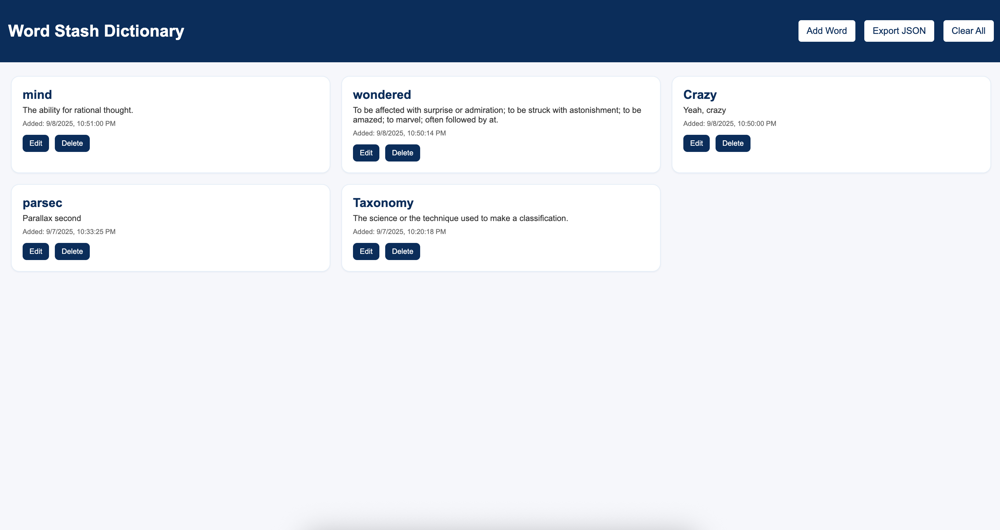

# Word Stash

**Word Stash** is a Chrome extension that lets you save words from any webpage, automatically fetch their meanings, and store them in your personal dictionary.
You can view, edit, export, or clear your word stash anytime.

---

## ✨ Features

- 📑 Save selected words via **right-click** → _Save to My Dictionary_.
- ⌨️ (Optional) Keyboard shortcut to save selected words.
- 📖 Automatic meaning lookup via [Free Dictionary API](https://dictionaryapi.dev/).
- 🗂 Full-page **dictionary view** with a clean UI.
- ✏️ Edit saved meanings directly.
- 🗑 Delete all words at once.
- 💾 Export your dictionary as a **JSON backup**.

---

## 📦 Installation (Developer Mode)

1. Clone or download this repo.
2. Open Chrome and go to `chrome://extensions/`.
3. Enable **Developer mode** (top-right toggle).
4. Click **Load unpacked** and select the project folder.
5. The extension icon should now appear in your toolbar.

---

## 🚀 Usage

1. Highlight a word on any webpage.
2. Right-click → **Save to My Dictionary**.
3. Click the extension icon → opens the **Word Stash** page.
4. Browse your saved words:
   - **Edit** meanings
   - **Clear all** words
   - **Export** dictionary as JSON

---

## 🛠 Tech Stack

- **Chrome Extensions API (Manifest v3)**
- **JavaScript** for background scripts & page logic
- **Free Dictionary API** for word meanings
- **HTML/CSS** for UI

---

## 📜 License

MIT License. Use and modify freely.
